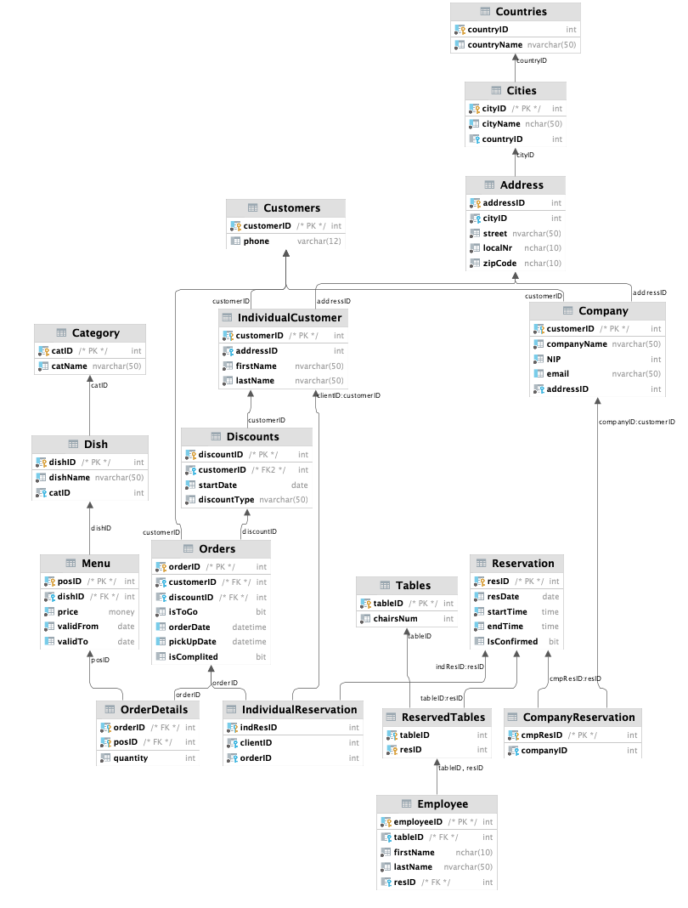

<h1> Restaurant management system.  🍽 🍲 </h1>

 Simple database supporting a catering company.

 The project was carried out as part of the "Basics of databases" course at AGH UST in a 3-person team. 

 A detailed description can be found <a href = "https://github.com/YoC00lig/Podstawy-baz-danych-projekt/blob/master/description.pdf"> here</a> (in Polish).

<h2>General informations:</h2>

 🔸 Take-away and on-site ordering service. 

 🔸 Table reservation for at least two people. 

 🔸 Offer for individual customers and companies. 

 🔸 Generating invoices (for a single order or for the whole month). 

<h2> Menu:</h2>

 🍔 At least half of the dishes in the menu is changed at least once every two weeks. 

 🍔 On selected days you can order seafood. 

 🍔 Menu is set the day before. 

<h2>Reservation:</h2>

 📋 Possible with the minimum value (WZ) of the order and WK previous orders.

 📋 Must be approved by the employee.

 📋 For companies: per company or for specific company employee (by name).

<h2>Discounts:</h2>

 ⬇️ One-time or long-perm discount.

 ⬇️ Available under certain conditions (for instance number of orders).

<h2>Reports:</h2>

 📊 Monthly and weekly reports.

 📊 Reports are available for both companies and individual customers.

 📊 Related to discount, number of orders, statistics etc.

 

<h2> 📌 Database diagram:</h2>

